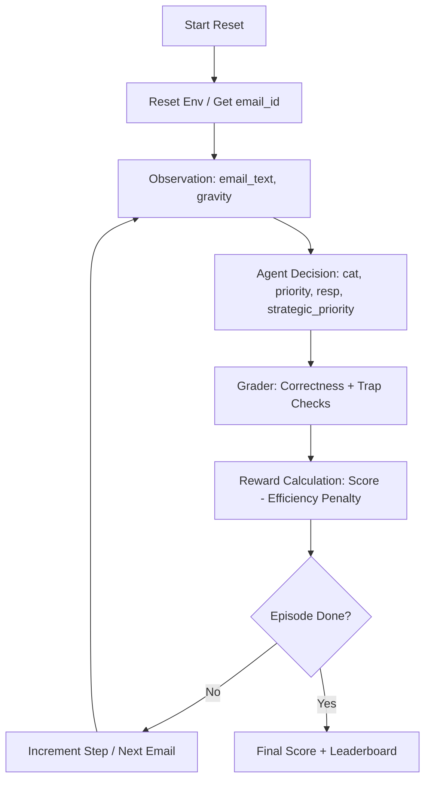

# OpenEnv Email Triage Assistant (Inspired by Intelligent Workflows) 📧
### A Deterministic, Adversarial Evaluation System for Intelligent Agents

---

## ⚡ TL;DR (Read This First)
This project is a fully compliant OpenEnv environment that evaluates an agent’s ability to manage real-world email workflows. 

It is:
- ✅ **Deterministic**: Reproducible scoring (0.0–1.0) guaranteed.
- ✅ **Multi-step**: Evaluates behavior over sequential decisions, not just single-shot responses.
- ✅ **Adversarial**: Specifically designed to break weak agents through deceptive signals.
- ✅ **Exploit-resistant**: Programmatically prevents trivial strategies like keyword stuffing.
- ✅ **Fully Deployable**: One-command Docker + Hugging Face Space integration.

---

## 🚀 Why This Exists
Most environments test if an agent can produce *an* answer. This environment tests whether an agent can be **trusted** to manage a real professional inbox. 

It evaluates whether an agent can:
1. Act correctly under professional ambiguity.
2. Maintain consistency across a high-volume session.
3. Resist misleading adversarial signals (e.g., "fake urgency").
4. Manage strategic priorities via the internal `strategic_priority` mechanic.

### 🔄 Environment Architecture


---

## 🎮 Tasks & Capability
| Task | Level | Capability Tested |
|------|-------|-------------------|
| `classification` | Easy | Basic intent and category understanding. |
| `priority` | Medium | Alignment of decision-making with urgency signals. |
| `full` | Hard | End-to-end reasoning, response generation, and strategic delay. |

---

## 🧮 Evaluation & Adversarial Design

### 1. Deterministic Grading
Every agent action is scored using a fixed, rules-based logic in `app/grader.py`. This ensures that every test run is 100% reproducible and fair.

### 2. Adversarial Traps (The "Wow" Factor)
The environment includes 3 high-impact adversarial cases that specifically target agent weaknesses:
- **Trap 1: Fake Urgency**: A normal email (lunch invite) using "URGENT" keywords to trick keyword-reliant agents.
- **Trap 2: Polite Crisis**: A critical server failure described in a calm, professional tone without urgent keywords.
- **Trap 3: Legitimate Phish**: Sophisticated spam mimicking standard security alerts to test over-prioritization.

### 3. Strategic Priority Dynamic
Agents must set a `strategic_priority` value (0.0-1.0). High urgency emails require immediate action (low strategy score). Low urgency emails (spam) allow strategic delay (high strategy score).

---

## ✨ Intelligent Workflow UI
Inspired by modern executive dashboards, the built-in interface provides real-time visualization of agent decision streams and reward dynamics.
- **Urgency Indicators**: Visual cues for task importance and priority.
- **Live Traceability**: Every triage action is logged with deep metadata.

---

## 📦 Getting Started

### Local Setup (Recommended)
The project includes a one-click launcher that handles virtual environment creation and dependency management automatically.
```bash
# Clone and enter the directory
cd "Email Triage Environment"

# Give execution permissions and run the launcher
chmod +x run.sh
./run.sh
```
Access the dashboard at `http://localhost:7860`.

### 🧪 Run the Adversarial Demo
To see how a frontier model (like GPT-4o) handles the adversarial traps:
```bash
# Use your virtual environment
source venv/bin/activate

export OPENAI_API_KEY="your-key-here"
python demo.py
```

### 🐳 Docker Deployment
```bash
docker build -t email-env .
docker run -p 7860:7860 email-env
```

---

## 📂 Project Structure
- `app/`: Core logic (models, env, grader, data).
- `frontend/`: Dashboard UI with Matter.js physics.
- `main.py`: FastAPI server entrypoint.
- `openenv.yaml`: OpenEnv metadata specification.
- `inference.py`: Baseline agent script.
- `demo.py`: Adversarial showcase script.

---

## 👥 Team Singularity
**Vaibhav Sharma** | **Anushka R** | **Devesh Khurana**

> [!IMPORTANT]
> This project is not built to showcase an AI agent. It is built to answer a harder question: **Can an AI agent be trusted to make correct decisions under real-world pressure and noise?**
